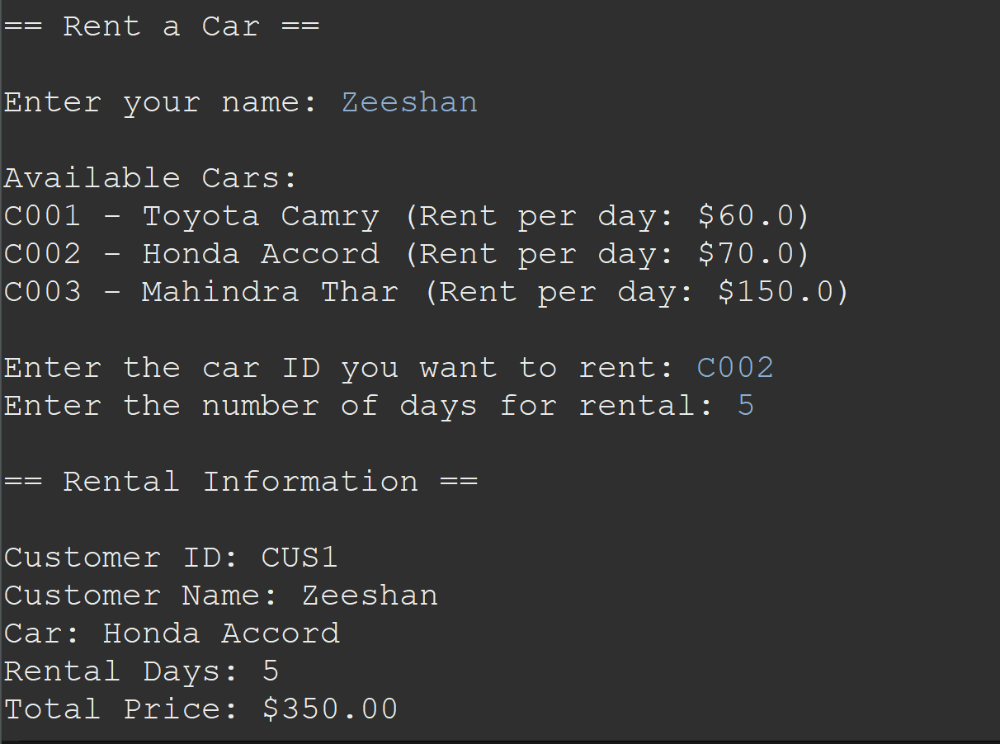

# Car Rental Application Documentation



## Overview

Welcome to the Car Rental Application, a Java-based solution for managing the rental of cars. This application allows users to rent a car from a list of available cars, specify the rental duration, return the rented car, and calculates the amount to be paid based on the car model type and the number of days it is rented for.

## Features

### 1. Renting a Car

Users can browse the list of available cars and choose the desired car to rent. They need to specify the number of days they intend to rent the car. The application ensures that only available cars are displayed for selection.

### 2. Returning a Rented Car

Once the rental period is over, users can return the rented car. The application updates the availability status of the car and finalizes the rental transaction.

### 3. Amount Calculation

The application calculates the amount to be paid based on the car model type and the number of days the car is rented for. Different car models may have different rental rates per day.

## How to Use

1. **Renting a Car**: Browse the list of available cars, select the desired car, and specify the number of days for rental.
2. **Returning a Rented Car**: When the rental period is over, return the car through the application.
3. **Amount Calculation**: The application automatically calculates the rental amount based on the car model type and the rental duration.

## Sample Code

```java
// Sample code snippet for renting a car
while (true) {
			System.out.println("===== Car Rental System =====");
			System.out.println("1. Rent a Car");
			System.out.println("2. Return a Car");
			System.out.println("3. Exit");
			System.out.print("Enter your choice: ");

			int choice = scanner.nextInt();
			scanner.nextLine(); // Consume newline

			if (choice == 1) {
				System.out.println("\n== Rent a Car ==\n");
				System.out.print("Enter your name: ");
				String customerName = scanner.nextLine();

				System.out.println("\nAvailable Cars:");
				for (Car car : cars) {
					if (car.isAvailable()) {
						System.out.println(car.getCarId() + " - " + car.getBrand() + " " + car.getModel() + " (Rent per day: $" + car.getbasePricePerDay() + ")");
					}
				}

				System.out.print("\nEnter the car ID you want to rent: ");
				String carId = scanner.nextLine();

				System.out.print("Enter the number of days for rental: ");
				int rentalDays = scanner.nextInt();
				scanner.nextLine(); // Consume newline

				Customer newCustomer = new Customer("CUS" + (customers.size() + 1), customerName);
				addCustomer(newCustomer);

				Car selectedCar = null;
				for (Car car : cars) {
					if (car.getCarId().equals(carId) && car.isAvailable()) {
						selectedCar = car;
						break;
					}
				}

				if (selectedCar != null) {
					double totalPrice = selectedCar.calculatePrice(rentalDays);
					System.out.println("\n== Rental Information ==\n");
					System.out.println("Customer ID: " + newCustomer.getCustomerId());
					System.out.println("Customer Name: " + newCustomer.getName());
					System.out.println("Car: " + selectedCar.getBrand() + " " + selectedCar.getModel());
					System.out.println("Rental Days: " + rentalDays);
					System.out.printf("Total Price: $%.2f%n", totalPrice);

					System.out.print("\nConfirm rental (Y/N): ");
					String confirm = scanner.nextLine();

					if (confirm.equalsIgnoreCase("Y")) {
						rentCar(selectedCar, newCustomer, rentalDays);
						System.out.println("\nCar rented successfully.");
					} else {
						System.out.println("\nRental canceled.");
					}
				} else {
					System.out.println("\nInvalid car selection or car not available for rent.");
				}
			} else if (choice == 2) {
				System.out.println("\n== Return a Car ==\n");
				System.out.print("Enter the car ID you want to return: ");
				String carId = scanner.nextLine();

				Car carToReturn = null;
				for (Car car : cars) {
					if (car.getCarId().equals(carId) && !car.isAvailable()) {
						carToReturn = car;
						break;
					}
				}

				if (carToReturn != null) {
					Customer customer = null;
					for (Rental rental : rentals) {
						if (rental.getCar() == carToReturn) {
							customer = rental.getCustomer();
							break;
						}
					}

					if (customer != null) {
						returnCar(carToReturn);
						System.out.println("Car returned successfully by " + customer.getName());
					} else {
						System.out.println("Car was not rented or rental information is missing.");
					}
				} else {
					System.out.println("Invalid car ID or car is not rented.");
				}
			} else if (choice == 3) {
				break;
			} else {
				System.out.println("Invalid choice. Please enter a valid option.");
			}
		}

		System.out.println("\nThank you for using the Car Rental System!");
}
